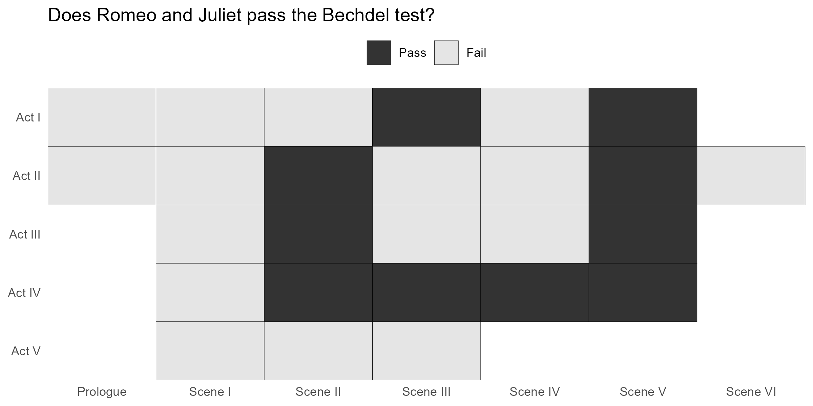
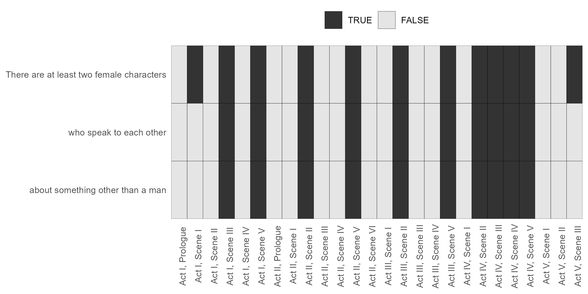

# The Bechdel Test

The Bechdel test is a measure of the representation of women in fictional works, especially film. For a work to pass the Bechdel test it must:

* feature at least two female characters;
* who talk to each other;
* about something other than a man.

See more on [Wikipedia](https://en.wikipedia.org/wiki/Bechdel_test).

## Data

The script data is scraped from [shakespeare.mit.edu/romeo_juliet/full.html](https://shakespeare.mit.edu/romeo_juliet/full.html), and processed into CSV format. The processing code can be found in the `R/scrape_data.R` file.

## Implementation

### Definition of female characters

The female characters in Romeo and Juliet are Lady Capulet, Lady Montague, Juliet, Nurse, and Rosaline. Note that Rosaline is a non-speaking character.

Some versions of the Bechdel test require that female characters be **named** female characters. This implementation does not make that requirement and so *Nurse* is included as a female character.

### Definition of a conversation

Two female characters are considered to be having a conversation if they have consecutive lines. There are limitations of this approach as two female characters may both be responding to a man and not each other. 

### Definitions of talking about something other than a man

The conversation between two female characters is considered to not be about a man if it does not contain any of the male names, or the words *he*, *him*, *his*, or *he's*.

> [!WARNING]
> The implementation of the third test is currently a work-in-progress. Currently if any individual line doesn't contain a mention of a man, it is considered a pass. This means the current pass rate is inflated.

## Results

### Overall Bechdel Test

### Individual Bechdel Test Elements

